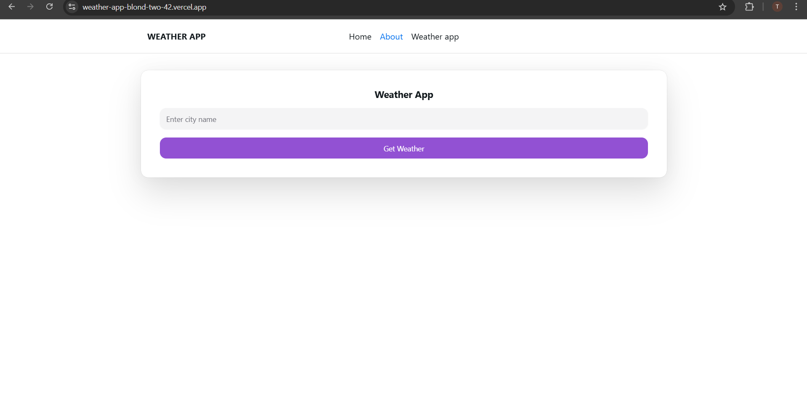
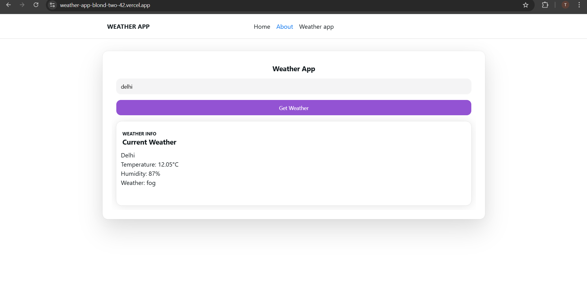

# Weather App
This is a weather application built using Next.js and Heroui (previously known as Next UI). It fetches weather data from the OpenWeather API.

You can access the application at [WEATHER APP](https://weather-app-blond-two-42.vercel.app/)


## Table of Contents

- [Technologies Used](#technologies-used)
- [Features](#features)
- [Screenshots](#screenshots)
- [Installation](#installation)
- [Running the Application](#running-the-application)
- [Contributing](#contributing)
- [License](#license)

  
## Technologies Used

- **Next.js**: A React framework that enables several extra features, including server-side rendering and generating static websites.
   [Learn more](https://nextjs.org/)
- **Heroui (previously Next UI)**: A React UI library that provides a set of high-quality components out of the box.
  [Learn more](https://nextui.org/)
- **OpenWeather API**: A service that provides weather data, including current weather, forecasts, and historical data to the developers.
   [Learn more](https://openweathermap.org/api)
- **Vercel**: A cloud platform for static sites and serverless functions that enables developers to deploy websites and web applications that deploy instantly, scale automatically, and require no supervision, all with no configuration.
  [Learn more](https://vercel.com/)

## Features

- Displays current weather information for a chosen location.
- Responsive design that works on both desktop and mobile devices.
- Clean and modern UI design.

## Screenshots

Here are some screenshots of the application:

### Home Page


### Weather Details


## Installation

1. Clone the repository:
   ```bash
   git clone https://github.com/tarunchauhan707/weather_app.git
   ```
2. Navigate to the project directory:
   ```bash
   cd weather_app
   ```
3. Install the dependencies:
   ```bash
   npm install
   ```
4. Create a .env.local file in the root directory and add your OpenWeather API key:
   ```bash
   NEXT_PUBLIC_OPENWEATHER_API_KEY=your_openweather_api_key
   ```

## Running the Application

1. Start the development server:
   ```bash
   npm run dev
   ```
2. Open your browser and navigate to http://localhost:3000.


## Contributing
Contributions are welcome! If you'd like to contribute, please follow these steps:

1. Fork the repository.
2. Create a new branch (`git checkout -b feature/YourFeature`).
3. Make your changes.
4. Commit your changes (`git commit -m 'Add some feature'`).
5. Push to the branch (`git push origin feature/YourFeature`).
6. Open a pull request.

## License
This project is licensed under the MIT License. See the [LICENSE](LICENSE) file for details.

## Contact
If you have any questions or feedback, feel free to reach out:
- GitHub: [tarunchauhan707](https://github.com/tarunchauhan707)

  
